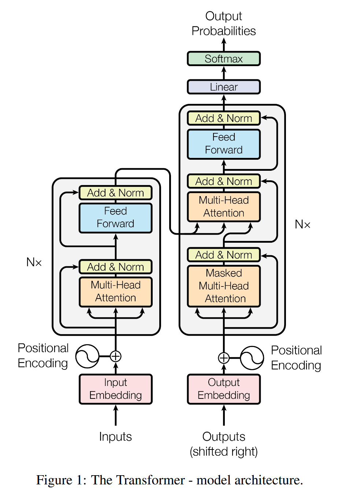

# MyTransformer

## Tokenizer

## Embedding

## Positional Encoding

## Encoder
### Attention

### Multi-Head Attention

### Feed Forward

### Add

### Layer Normalization

## Decoder

### Masked Multi-Head Attention

### Cross Attention

## Linear

## Softmax

## Loss

## Data

## Training

## Inference

